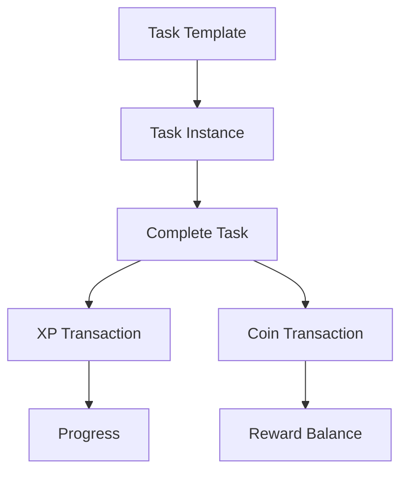

# Gamified Daily Task & Progress App

## 1. Project Vision

Build a personal productivity application that combines:

* Daily task management
* One-time/date-specific tasks
* Recurring tasks
* Task completion history
* XP/progression
* Levels
* Spendable coins
* Rewards
* Streaks
* Daily/weekly/monthly statistics
* A calendar-based history

The core philosophy is:

> **Don't just tell me what I have to do. Show me what I've actually accomplished.**

This should NOT feel like a generic todo-list CRUD application.

The application should create a persistent record of the user's productivity over time and use gamification to make consistency rewarding.

---

# 2. Important Product Distinction

There are two fundamentally different concepts:

## A. Task Template

A reusable definition of a task.

Example:

```text
Name: DSA Practice
Repeat: DAILY
XP Reward: 30
Category: Learning
```

This does NOT represent today's task.

It represents the rule from which daily task instances are generated.

## B. Task Instance

The actual occurrence of a task on a particular date.

Example:

```text
Task: DSA Practice
Date: 2026-09-29
Status: COMPLETED
XP Earned: 30
Completed At: 2026-09-29 07:15
```

The system must preserve task instances historically.

Do NOT simply overwrite a recurring task's status every day.

A recurring task must produce separate date-specific instances.

---

# 3. Task Types

## Recurring Tasks

Tasks that repeat according to a schedule.

Initial supported recurrence:

* DAILY
* WEEKLY

Example:

```text
DSA Practice
Every day
+30 XP
```

The system should eventually be designed so additional recurrence patterns can be added without redesigning the entire application.

## One-Time Tasks

Tasks belonging to a specific date.

Example:

```text
Submit Java assignment
Date: September 29
+20 XP
```

After September 29, it should remain in history but should not automatically appear on September 30.

---

# 4. Task Properties

A task should support at least:

```text
id
title
description
category
priority
task type
recurrence rule
scheduled date
XP reward
coin reward
status
createdAt
completedAt
```

Possible statuses:

```text
PENDING
COMPLETED
MISSED
CANCELLED
```

Do not permanently delete completed historical task instances merely because the original task/template is deleted.

History matters.

---

# 5. Daily Dashboard

The primary screen should focus on TODAY.

Example:

```text
-----------------------------------
          SEPTEMBER 29

          LEVEL 7
        1,240 XP

       ████████░░ 80%

       80 / 100 XP
-----------------------------------

TODAY

☑ Wake up early             +10 XP
☑ DSA Practice              +30 XP
☑ Backend Study             +30 XP
☐ Evening Walk              +10 XP
☐ College Notes             +10 XP

-----------------------------------

Today's Progress: 60%

🔥 DSA Streak: 12 days
🔥 Overall Streak: 7 days
-----------------------------------
```

The interface should make the following immediately visible:

1. Today's tasks
2. Completion progress
3. XP earned today
4. Current level
5. Current streak
6. Remaining tasks

Avoid clutter.

---

# 6. XP System

XP represents permanent progress.

Example:

```text
DSA Practice       +30 XP
Backend Study      +30 XP
Exercise            +20 XP
Reading             +10 XP
```

XP should be recorded through an immutable/event-like ledger rather than simply modifying one number with no history.

For example:

```text
XP Ledger

+30  DSA Practice
+30  Backend Study
+20  Exercise
```

This allows the application to explain where the user's XP came from.

XP should generally NOT decrease when a task is missed.

---

# 7. Level System

Implement a level progression system.

Example:

```text
Level 1 → 0 XP
Level 2 → 100 XP
Level 3 → 250 XP
Level 4 → 450 XP
Level 5 → 700 XP
```

The exact progression formula should be configurable rather than hardcoded throughout the application.

The UI should show:

```text
LEVEL 7

1,240 / 1,500 XP

████████░░
```

When the user levels up, show a clear visual notification.

---

# 8. Coin System

Coins are different from XP.

XP = permanent progression.

Coins = spendable currency.

Example:

```text
Completed DSA       +30 XP
                     +10 coins
```

Coins can be spent on user-defined rewards.

Example rewards:

```text
Watch a movie       100 coins
Gaming session      250 coins
Order food          500 coins
Buy something       1000 coins
```

The application should maintain a transaction history for coins.

Do not simply modify the balance without recording why it changed.

Example:

```text
+100 coins
Reason: Completed weekly goal

-250 coins
Reason: Redeemed "Gaming Session"
```

---

# 9. Reward System

Users should be able to create their own rewards.

Reward properties:

```text
id
name
description
coinCost
active
createdAt
```

Example:

```text
Reward:
"2 hour gaming session"

Cost:
250 coins
```

When redeemed:

1. Verify sufficient coins.
2. Deduct coins.
3. Create a redemption transaction.
4. Record redemption timestamp.
5. Show confirmation.

Never allow the frontend alone to determine whether the user has enough coins.

The backend must enforce this.

---

# 10. Streak System

Track consistency separately from XP.

Examples:

```text
Overall Streak: 7 days

DSA Practice: 12 days
Exercise: 5 days
Backend Study: 9 days
```

A streak should be based on actual completion history.

Do not simply increment a number every time a task is completed.

The backend should be able to reconstruct or verify streaks from task history.

---

# 11. Recovery Mechanism

Consider supporting recovery tokens.

Example:

```text
🔥 14 day streak

Recovery Tokens: 1
```

If the user misses one qualifying day:

```text
You missed today's DSA Practice.

Use Recovery Token?

[Use Token]
```

Using the token preserves the relevant streak.

This should be implemented in a way that does not corrupt the actual task history.

The historical record should still show that the task was missed.

The recovery mechanism is a streak calculation rule, not falsification of the task history.

---

# 12. History

The user must be able to inspect previous days.

Example:

```text
September 29

8 tasks
6 completed
2 missed

XP earned: 130
Coins earned: 50
Completion: 75%
```

September 28:

```text
7 tasks
7 completed

XP earned: 160
Completion: 100%
```

The user should be able to click a date and see that day's actual task instances.

---

# 13. Calendar

Provide a monthly calendar.

Example:

```text
       September 2026

 M  T  W  T  F  S  S
    1  2  3  4  5  6
 7  8  9 10 11 12 13
14 15 16 17 18 19 20
21 22 23 24 25 26 27
28 29 30
```

Days should visually indicate productivity.

Possible states:

```text
Excellent completion
Good completion
Average completion
Low completion
No activity
```

Do not make the colors the only source of information; provide accessible labels/tooltips.

Clicking a date should open that day's summary.

---

# 14. Statistics

Provide useful statistics without turning the app into a spreadsheet.

Initial statistics:

### Daily

```text
Tasks completed
Tasks missed
XP earned
Coins earned
Completion percentage
```

### Weekly

```text
Total tasks
Completed tasks
Completion percentage
XP earned
Longest streak
```

### Monthly

```text
Total XP
Average daily completion
Best day
Total completed tasks
Current streak
Longest streak
```

Charts can be added later.

---

# 15. Task Categories

Allow tasks to belong to categories.

Examples:

```text
Learning
Health
College
Work
Personal
Other
```

The category system should be extensible.

Later, statistics can show:

```text
Learning      82%
Health        71%
College       90%
Personal      65%
```

---

# 16. Notifications / Reminders

Design the architecture so reminders can eventually be supported.

Examples:

```text
DSA Practice
7:00 AM

Backend Study
6:00 PM
```

Do not make notifications the first implementation priority.

The core task/history/gamification system must work independently.

---

# 17. Backend Architecture

Use a proper backend architecture.

Preferred stack:

```text
Spring Boot
Java
PostgreSQL
REST API
JPA/Hibernate
Bean Validation
Spring Security where authentication is implemented
```

Keep responsibilities separated.

Suggested structure:

```text
controller
service
repository
entity
dto
mapper
exception
security
config
```

Do not put business logic directly into controllers.

Controllers should primarily handle HTTP concerns.

Services should contain business rules.

Repositories should handle persistence.

---

# 18. Important Backend Business Rules

The backend is the trusted source of truth.

Never trust the frontend for:

* XP calculation
* Coin balance
* Reward redemption
* Task completion rewards
* Streak calculation
* Level calculation
* Authorization
* Ownership checks

For example, the frontend should NOT be able to send:

```json
{
  "xp": 1000
}
```

and have the backend blindly award 1000 XP.

Instead:

```text
User completes task
        ↓
Backend verifies task ownership
        ↓
Backend verifies task status
        ↓
Backend determines reward
        ↓
Backend creates XP transaction
        ↓
Backend updates/recalculates progression
```

---

# 19. Data Integrity

Pay particular attention to duplicate rewards.

If the user clicks "Complete" twice, they must NOT receive:

```text
+30 XP
+30 XP
```

for the same task instance.

Task completion and reward generation should be idempotent.

Similarly, a reward redemption should never allow coins to be spent twice because of duplicate requests.

Use proper database constraints and/or transactional service logic.

---

# 20. Suggested Core Entities

The exact schema is up to the implementation agent, but conceptually consider:

```text
User

TaskTemplate

TaskInstance

XPTransaction

CoinTransaction

Reward

RewardRedemption

Streak

RecoveryToken
```

Do not blindly create every entity if the architecture does not require it.

Prefer a clean model over excessive tables.

---

# 21. Transactional Operations

Important operations should be transactional.

For example:

```text
Complete Task
    ↓
Mark task completed
    ↓
Create XP transaction
    ↓
Create coin transaction
    ↓
Update/recalculate progression
```

These operations should not leave the database in a partially updated state.

Similarly:

```text
Redeem Reward
    ↓
Check balance
    ↓
Deduct coins
    ↓
Create redemption record
```

must be atomic.

---

# 22. Frontend

Preferred:

```text
React
TypeScript
```

The UI should communicate with the backend through a clean API client.

Do not put trusted business rules in React.

Frontend responsibilities:

* Display tasks
* Collect user input
* Show progress
* Provide optimistic UI only where safe
* Display validation errors
* Display statistics
* Handle navigation

Backend responsibilities:

* Business rules
* Authorization
* XP
* Coins
* Streaks
* Rewards
* Persistence

---

# 23. API Design

Design REST endpoints logically.

Examples:

```text
GET    /api/tasks/today

POST   /api/tasks

POST   /api/tasks/{id}/complete

PATCH  /api/tasks/{id}

DELETE /api/tasks/{id}

GET    /api/history/{date}

GET    /api/history

GET    /api/progress

GET    /api/streaks

GET    /api/rewards

POST   /api/rewards

POST   /api/rewards/{id}/redeem

GET    /api/transactions/xp

GET    /api/transactions/coins
```

Do not blindly follow these exact URLs if a better REST design is appropriate.

Keep the API consistent.

---

# 24. Authentication

The application should eventually support user accounts.

At minimum:

```text
Register
Login
Logout
Current user
```

Every task and transaction must belong to the appropriate user.

A user must never be able to access another user's data by changing an ID in an API request.

---

# 25. Important Date/Time Rule

The concept of "today" must be handled carefully.

Do not simply rely on the server's timezone.

The system should have an explicit user timezone, for example:

```text
Asia/Kolkata
```

Daily task generation and streak calculations should use the user's timezone.

This becomes important when the application is deployed to a cloud server running in another timezone.

---

# 26. Recurring Task Generation

Think carefully about how recurring tasks become task instances.

Do NOT create thousands of future task records unnecessarily.

A possible approach:

```text
TaskTemplate
      ↓
Today's date
      ↓
Determine applicable recurring templates
      ↓
Create TaskInstances when needed
```

The implementation agent should choose the cleanest strategy.

The important requirement is:

> Historical task instances must remain stable even if the original recurring task is edited later.

For example:

If:

```text
DSA Practice = +30 XP
```

was completed yesterday and tomorrow the user changes it to:

```text
DSA Practice = +50 XP
```

yesterday's historical transaction must remain +30 XP.

---

# 27. Editing Recurring Tasks

Be careful with editing recurring tasks.

If the user changes:

```text
DSA Practice
+30 XP → +50 XP
```

the change should affect future instances according to the chosen recurrence semantics.

It must NOT rewrite historical XP transactions.

The UI should make this distinction clear.

---

# 28. MVP

Build the first version in this order.

### Phase 1 — Foundation

* Project setup
* Database
* User
* Task template
* Task instance
* Basic authentication

### Phase 2 — Daily Tasks

* Create task
* One-time task
* Recurring daily task
* Today's task list
* Complete task
* Missed task
* History

### Phase 3 — Gamification

* XP
* XP transactions
* Levels
* Coins
* Coin transactions

### Phase 4 — Rewards

* Create rewards
* Redeem rewards
* Redemption history

### Phase 5 — Streaks

* Overall streak
* Per-task streak
* Recovery tokens

### Phase 6 — Analytics

* Calendar
* Daily statistics
* Weekly statistics
* Monthly statistics
* Progress charts

### Phase 7 — Polish

* Notifications
* Animations
* Better UX
* Accessibility
* Mobile responsiveness
* Performance improvements

---

# 29. UI Philosophy

The UI should feel motivating but not childish.

Avoid turning it into a cartoon RPG.

Preferred feeling:

```text
Personal productivity dashboard
+
Light gamification
+
Clear progress visualization
```

The application should feel satisfying when a task is completed.

For example:

```text
☑ DSA Practice

+30 XP
+10 coins

🔥 Streak: 13 days
```

A subtle animation is enough.

---

# 30. Architecture First

Before writing large amounts of code:

1. Understand the requirements.
2. Propose the domain model.
3. Explain the relationship between TaskTemplate and TaskInstance.
4. Design the database schema.
5. Design the API.
6. Explain the XP/coin transaction model.
7. Explain recurrence handling.
8. Explain streak calculation.
9. Identify edge cases.
10. Then implement.

Do not immediately generate the entire application.

The goal is to produce code that is understandable and maintainable, not merely code that happens to work.

---

# 31. Edge Cases To Consider

Explicitly reason about:

* Completing a task twice
* Uncompleting a task
* Deleting a recurring task
* Editing a recurring task
* Changing XP after historical completion
* Missing a task
* Timezone changes
* Daylight-saving changes
* User changing timezone
* Duplicate reward redemption requests
* Negative coin balances
* Level calculation after XP changes
* Streak calculation across missed days
* Recovery tokens
* Account deletion
* Database transaction failures
* Concurrent requests
* User attempting to access another user's task
* Server restart during task generation

Do not implement complicated behavior without documenting the chosen rule.

---

# 32. Development Principles

Prioritize:

```text
Correct domain model
>
Data integrity
>
Security
>
Understandable code
>
Good UX
>
Animations / polish
```

Do not sacrifice backend correctness for frontend appearance.

Do not use AI-generated abstractions simply because they look sophisticated.

Avoid unnecessary microservices.

This application should initially be a **modular monolith**.

One Spring Boot application + one PostgreSQL database is sufficient.

---

# 33. Future Possibilities

Keep the architecture extensible enough for future features such as:

```text
Weekly challenges
Achievements
Badges
Goals
Pomodoro sessions
Focus sessions
Leaderboards
Social features
AI productivity insights
Calendar integration
Mobile application
Offline support
Push notifications
Custom reward rules
Task difficulty
XP multipliers
Daily quests
```

Do not implement these now unless they are required for the MVP.

---

# 34. Final Product Principle

The application should answer four questions clearly:

### What do I need to do today?

→ Tasks

### What have I actually done?

→ History

### Am I becoming more consistent?

→ Streaks + statistics

### Am I making progress?

→ XP + levels + rewards

The core loop is:

```text
        PLAN
          ↓
        DO TASK
          ↓
       COMPLETE
          ↓
    ┌─────┴─────┐
    ↓           ↓
   XP          COINS
    ↓           ↓
 LEVEL UP      REWARD
    ↓
 PROGRESS
    ↓
 HISTORY
    ↓
 CONSISTENCY
    ↓
    └──────→ PLAN
```

Build the application around this loop.

Do not reduce the concept to a simple CRUD todo application.


# 35. IMPORTANT: HOW TO WORK ON THIS PROJECT

The preceding specification defines the product requirements.

Do NOT replace or simplify those requirements.

The instructions in this section define how you should work as the implementation agent.

---

# 36. DO NOT RUSH INTO CODE

Before implementing the application, inspect the requirements and reason about the domain.

First produce:

1. Proposed architecture
2. Domain model
3. Entity relationships
4. Database schema
5. API contract
6. Task lifecycle
7. Recurring-task lifecycle
8. XP transaction flow
9. Coin transaction flow
10. Streak calculation strategy
11. Authentication/authorization strategy
12. Important edge cases

Then begin implementation.

If you identify an ambiguity, choose a sensible implementation based on the principles already defined in this specification and document the decision.

Do not ask unnecessary questions simply because multiple implementations are technically possible.

---

# 37. BUILD IN VERTICAL SLICES

Do not create 100 empty classes first.

Implement functionality in working vertical slices.

For example:

```text
Database
   ↓
Entity
   ↓
Repository
   ↓
Service
   ↓
Controller
   ↓
API
   ↓
Frontend
   ↓
User-visible functionality
```

A feature should become usable before moving to excessive abstraction.

Preferred progression:

```text
Authentication
      ↓
Create task
      ↓
View today's tasks
      ↓
Complete task
      ↓
XP
      ↓
History
      ↓
Coins
      ↓
Rewards
      ↓
Streaks
      ↓
Analytics
```

At every major stage, the application should remain runnable.

---

# 38. DO NOT OVERENGINEER

This is initially a personal productivity application.

Do NOT introduce:

* Microservices
* Kubernetes
* Kafka
* Event-driven distributed architecture
* CQRS
* Event sourcing
* Multiple databases
* Redis unless actually necessary
* Complex cloud infrastructure

The preferred architecture is:

```text
React
   ↓
REST API
   ↓
Spring Boot
   ↓
PostgreSQL
```

A modular monolith is the correct starting point.

Use good architecture without architecture astronautics.

---

# 39. DOMAIN-FIRST THINKING

The most important part of this application is not the UI.

It is the domain model.

Think carefully about these concepts:

```text
TaskTemplate
      ↓
TaskInstance
      ↓
Completion
      ↓
Reward Transaction
      ↓
Progress
```

A recurring task is a rule.

A task instance is an occurrence of that rule.

A completion is an event/state transition.

An XP transaction records the reward generated by that completion.

These concepts should not be collapsed into one giant entity.

---

# 40. TASK LIFECYCLE

Define and enforce a clear lifecycle.

Example:

```text
PENDING
   │
   ├──────────────→ CANCELLED
   │
   ↓
COMPLETED
```

At the end of its relevant day:

```text
PENDING
   ↓
MISSED
```

However, define exactly when a task becomes MISSED.

Use the user's timezone.

Do not allow arbitrary status changes that could corrupt history.

If an "uncomplete" feature is supported, define what happens to:

* XP
* Coins
* Streaks
* Transactions
* Level
* History

Do not silently reverse rewards without a transaction record.

---

# 41. IMMUTABLE FINANCIAL-LIKE RECORDS

Treat XP and coin transactions similarly to financial ledger entries.

For example:

```text
XPTransaction

id
userId
amount
type
source
referenceId
createdAt
```

Examples:

```text
+30
TASK_COMPLETION
taskInstanceId = 123
```

and:

```text
-250
REWARD_REDEMPTION
rewardId = 8
```

Do not make historical records dependent on the current task configuration.

If a task currently gives 50 XP but previously gave 30 XP, historical transactions remain 30 XP.

This is extremely important.

---

# 42. BALANCE VS LEDGER

You may maintain a cached balance for performance.

For example:

```text
user.xp
user.coins
```

But the transaction history must remain authoritative/auditable enough to understand where the balance came from.

Do not design the system so that:

```text
coins = 500
```

is the only information available.

The system should be able to answer:

> Why does this user have 500 coins?

---

# 43. IDEMPOTENCY

Critical operations must be safe against duplicate requests.

Example:

```text
POST /tasks/123/complete
```

If the same request arrives twice, the user must not receive:

```text
+30 XP
+30 XP
+20 coins
+20 coins
```

The operation should produce one logical completion.

Possible strategies include:

* State checks
* Database unique constraints
* Transactional logic
* Idempotency keys where appropriate

Choose the simplest robust solution.

---

# 44. DATABASE CONSTRAINTS

Do not rely entirely on Java validation.

Use database constraints where they protect data integrity.

Examples:

* Unique user email
* Unique task-instance per template/date where appropriate
* Non-negative coin balance
* Valid foreign keys
* Required fields
* Appropriate indexes

Use indexes for common queries such as:

```text
user + date
user + task status
user + transaction date
user + reward
```

Do not blindly index every column.

---

# 45. API ERROR HANDLING

Create consistent API error responses.

For example:

```json
{
  "timestamp": "...",
  "status": 400,
  "error": "TASK_ALREADY_COMPLETED",
  "message": "This task has already been completed."
}
```

Use appropriate HTTP status codes.

Examples:

```text
400 → Invalid request
401 → Unauthenticated
403 → Unauthorized
404 → Resource not found
409 → Conflict
422 → Validation failure where appropriate
500 → Unexpected server error
```

Do not expose stack traces or internal database details to the frontend.

---

# 46. VALIDATION

Validate input on the backend.

Examples:

Task title:

```text
Required
Maximum reasonable length
```

XP reward:

```text
Must be positive
Must have sensible upper bounds
```

Coin reward:

```text
Must not be negative
```

Reward price:

```text
Must be positive
```

Do not trust frontend validation.

Frontend validation is for user experience.

Backend validation is for correctness.

---

# 47. AUTHORIZATION

Authentication answers:

> Who are you?

Authorization answers:

> Are you allowed to access this resource?

Every user-owned resource must be checked.

For example:

```text
GET /api/tasks/123
```

must not simply search:

```text
findById(123)
```

and return it.

It should ensure task 123 belongs to the authenticated user.

Avoid insecure direct object references.

---

# 48. DATABASE MIGRATIONS

Use proper database migrations from the beginning.

Prefer:

```text
Flyway
```

or another appropriate migration system.

Do not depend on manually modifying production databases.

Schema changes should be version-controlled.

Example:

```text
V1__create_users.sql
V2__create_tasks.sql
V3__create_transactions.sql
```

Use whichever migration naming convention is appropriate for the selected tool.

---

# 49. CONFIGURATION

Do not hardcode:

* Database passwords
* JWT secrets
* API keys
* Production URLs
* Encryption secrets

Use environment variables/configuration.

Provide an example configuration such as:

```text
.env.example
```

without real secrets.

---

# 50. LOCAL DEVELOPMENT

The project should be easy to run locally.

Document prerequisites.

Example:

```text
Java
Maven
Node.js
PostgreSQL
```

Provide clear commands:

```text
Backend:
./mvnw spring-boot:run

Frontend:
npm install
npm run dev
```

Use the actual commands appropriate for the generated project.

---

# 51. DOCKER

If Docker is included, keep it simple.

A reasonable development setup could eventually be:

```text
React
Spring Boot
PostgreSQL
```

Do not containerize everything merely for the sake of saying the project uses Docker.

A PostgreSQL Docker container is sufficient for local development if appropriate.

Provide:

```text
docker-compose.yml
```

only if it genuinely simplifies setup.

---

# 52. FRONTEND STATE

Do not put the entire application state into one enormous global store.

Separate concerns.

Examples:

```text
Authentication state
Task data
Progress data
UI state
```

Use the simplest state-management solution that fits.

Do not install a large state-management framework unless needed.

---

# 53. API CLIENT

Create a clean API layer.

For example:

```text
api/
  authApi
  taskApi
  progressApi
  rewardApi
  historyApi
```

The React components should not contain repeated raw HTTP calls everywhere.

Avoid:

```text
fetch(...)
fetch(...)
fetch(...)
fetch(...)
```

inside dozens of components.

---

# 54. UI COMPONENT DESIGN

Build reusable components where there is genuine reuse.

Examples:

```text
TaskCard
ProgressBar
XPDisplay
CoinDisplay
StreakBadge
Calendar
RewardCard
TransactionList
```

Do not turn every `<div>` into a component.

Componentization should improve readability.

---

# 55. RESPONSIVE DESIGN

The application should work well on:

```text
Desktop
Tablet
Mobile
```

The mobile experience is important because the user should be able to quickly check and complete tasks from a phone.

However, do not build a separate mobile application in the MVP unless explicitly requested.

Make the web application responsive first.

---

# 56. ACCESSIBILITY

Include basic accessibility:

* Semantic HTML
* Keyboard navigation
* Visible focus states
* Accessible buttons
* Labels for inputs
* Meaningful error messages
* Tooltips/labels for icons
* Do not rely solely on color to communicate status

For example, do not make:

```text
green = completed
red = missed
```

without accessible text or another indicator.

---

# 57. VISUAL DESIGN

The design should be:

* Clean
* Modern
* Focused
* Motivating
* Not childish
* Not overloaded with gamification

The dashboard should emphasize:

```text
Today's tasks
Progress
XP
Streak
```

Secondary information can live behind navigation.

Suggested navigation:

```text
Dashboard
Tasks
Calendar
Progress
Rewards
Settings
```

Adjust this if a better information architecture emerges.

---

# 58. COMPLETION FEEDBACK

Completing a task should feel satisfying.

Example:

```text
☑ DSA Practice

+30 XP
+10 coins

🔥 13 day streak
```

Use subtle animations.

Do NOT make every interaction explode into a full-screen celebration.

Reserve stronger animations for:

* Level up
* Achievement
* Major streak milestone
* Reward redemption

---

# 59. EMPTY STATES

Design useful empty states.

Examples:

No tasks today:

```text
Nothing scheduled for today.

Enjoy the empty calendar — or add something useful.
```

No rewards:

```text
You haven't created any rewards yet.
Create something worth working toward.
```

No history:

```text
Your productivity history will appear here
once you start completing tasks.
```

Do not leave blank screens.

---

# 60. LOADING AND ERROR STATES

Every asynchronous page should account for:

```text
Loading
Success
Empty
Error
```

Do not display a blank screen while waiting for the backend.

Provide useful retry behavior where appropriate.

---

# 61. TIMEZONE DESIGN

Store timestamps in a consistent representation such as UTC.

Store the user's preferred timezone separately.

For example:

```text
timezone = Asia/Kolkata
```

Convert timestamps for display.

Daily boundaries must be calculated using the user's timezone.

Example:

A task completed at:

```text
2026-09-29 00:30 UTC
```

may belong to September 29 or September 28 depending on the user's timezone.

Do not use server-local time for user-facing daily logic.

---

# 62. RECURRING TASK GENERATION STRATEGY

Do not blindly create future instances for months or years.

Prefer generating instances when needed or through a controlled scheduled process.

For today's dashboard:

```text
Get recurring templates applicable to today
       ↓
Check whether today's instance exists
       ↓
Create if necessary
       ↓
Return today's instances
```

The implementation may choose another robust approach.

Document the chosen strategy.

---

# 63. HISTORICAL STABILITY

Historical data must not change unexpectedly.

Example:

September 28:

```text
DSA Practice
+30 XP
```

September 29:

User edits template:

```text
DSA Practice
+50 XP
```

September 28 must remain:

```text
+30 XP
```

The history represents what actually happened.

It must not be recalculated from today's task configuration.

---

# 64. STREAK DEFINITION

Define streak rules explicitly.

Do not use vague logic such as:

```text
if completed then streak++
```

A streak should consider dates.

For example, an overall daily streak might require the user to complete at least one qualifying task each calendar day.

A task-specific streak might require that particular recurring task to be completed on consecutive applicable dates.

Document exactly which definition is being implemented.

Different streak types may have different rules.

---

# 65. MISSED TASKS

A missed task should remain in history.

Example:

```text
September 29

☑ DSA Practice
☑ Backend Study
✕ Evening Walk
```

Do not simply delete missed tasks.

A productivity system without failure history gives a misleading picture.

The goal is to understand behavior, not manufacture a perfect record.

---

# 66. REWARD REDIRECTION

Rewards should not be coupled directly to one specific task.

For example:

```text
Task → Coins
Coins → Reward
```

rather than:

```text
Complete DSA → Unlock Movie
```

This keeps the reward system flexible.

---

# 67. ACHIEVEMENTS — FUTURE DESIGN

Do not implement achievements unless needed for MVP.

However, design the code so achievements could eventually listen to facts such as:

```text
Completed 10 tasks
Reached 1000 XP
Maintained 7-day streak
Completed 30 DSA sessions
Completed 100 total tasks
```

Avoid hardcoding achievements into TaskService.

A future achievement system should be able to evaluate user progress independently.

---

# 68. TESTING STRATEGY

Testing is mandatory.

At minimum include:

## Unit tests

Test business logic such as:

```text
XP calculation
Level calculation
Coin calculation
Streak calculation
Task state transitions
Recurrence logic
Reward redemption
```

## Integration tests

Test:

```text
Controller → Service → Repository → Database
```

for important workflows.

## Security tests

Verify:

```text
User A cannot access User B's task
User A cannot redeem User B's reward
Unauthenticated requests cannot access protected resources
```

---

# 69. CRITICAL TEST CASES

Explicitly test:

### Completing a task once

```text
Task = PENDING

Complete

Task = COMPLETED
XP = +30
Coins = +10
```

### Completing it twice

```text
First request:
+30 XP

Second request:
No additional XP
```

### Reward redemption with enough coins

```text
Balance = 500
Reward = 250

Result:
Balance = 250
Redemption recorded
```

### Reward redemption without enough coins

```text
Balance = 100
Reward = 250

Result:
Rejected
Balance remains 100
No redemption recorded
```

### Historical XP

```text
Old task reward = 30
New task reward = 50

Old transaction remains 30
```

### Authorization

```text
User A task
User B requests it

Result:
403 or 404 according to the chosen API security convention.
```

---

# 70. TEST DATABASE

Tests should not depend on a developer's personal PostgreSQL data.

Use an isolated test database or appropriate test infrastructure.

Do not require manually inserting rows before running tests.

Tests should be reproducible.

---

# 71. SEED DATA

For development, optional seed data can make the UI easier to evaluate.

Example:

```text
DSA Practice
Backend Study
Exercise
College Notes
Evening Walk
```

But clearly separate seed/demo data from production data.

Do not hardcode these tasks into the actual application logic.

---

# 72. LOGGING

Use meaningful server-side logs.

Examples:

```text
Task completed
Reward redeemed
Authentication failure
Unexpected exception
```

Do not log:

* Passwords
* JWT secrets
* Sensitive tokens
* Full authentication credentials

Use appropriate log levels.

---

# 73. DOCUMENTATION

Create a useful README.

The README should explain:

```text
Project overview
Features
Architecture
Technology stack
Project structure
Database setup
Environment variables
Running locally
Testing
API overview
Future roadmap
```

Include an architecture diagram if practical.

The README should explain the important domain distinction:

```text
TaskTemplate ≠ TaskInstance
```

This is one of the central architectural concepts of the project.

---

# 74. ARCHITECTURE DOCUMENT

Create a document such as:

```text
docs/architecture.md
```

Include:

```text
System architecture
Domain model
Database relationships
Task lifecycle
XP flow
Coin flow
Reward flow
Streak calculation
Authentication flow
```

Use simple diagrams where useful.

Mermaid diagrams are acceptable.

Example:



---

# 75. API DOCUMENTATION

If practical, use OpenAPI/Swagger.

Document:

* Endpoints
* Request bodies
* Response bodies
* Authentication requirements
* Error responses

Do not expose secrets in API documentation.

---

# 76. GIT PRACTICES

Use meaningful commits.

Examples:

```text
feat: add task domain model
feat: implement daily task API
feat: add task completion rewards
feat: add XP transaction ledger
feat: add reward redemption
test: add streak calculation tests
docs: add architecture documentation
```

Avoid one giant commit containing the entire application if the development workflow allows incremental commits.

---

# 77. CODE QUALITY

Prefer code that a junior-to-intermediate developer can understand.

Avoid:

* Clever one-liners
* Unnecessary design patterns
* Massive service classes
* God objects
* Hidden side effects
* Magic numbers
* Hardcoded business rules
* Deep inheritance hierarchies

Use meaningful names.

For example:

Good:

```text
calculateRequiredXpForNextLevel()
```

Bad:

```text
calc()
```

---

# 78. BUSINESS RULE CENTRALIZATION

Rules should have a clear home.

For example:

```text
XP calculation
→ ProgressionService

Reward redemption
→ RewardService

Streak calculation
→ StreakService

Task completion
→ TaskService
```

Do not duplicate the same rule across:

```text
Controller
Frontend
Database trigger
```

unless there is a specific reason.

---

# 79. NO FRONTEND TRUST

The frontend may display:

```text
+30 XP
```

but the backend determines whether the user actually deserves it.

The frontend must never be able to say:

```text
"I completed this task, therefore give me 500 XP."
```

The server calculates the reward based on stored task configuration.

---

# 80. SECURITY BASELINE

Use standard security practices.

At minimum:

* Password hashing
* Secure authentication
* Authorization checks
* Input validation
* CORS configuration
* Secure secrets
* SQL injection protection through JPA/parameterized queries
* No sensitive information in logs
* No sensitive information in frontend source
* Proper error handling

If JWT is used, design token handling carefully.

Do not store authentication secrets in source code.

---

# 81. PERFORMANCE

Do not optimize prematurely.

However, avoid obvious problems such as:

```text
N+1 database queries
```

or loading an entire user's historical transaction database merely to show today's XP.

Use appropriate queries.

For example:

```text
Today's tasks → date-filtered query
Today's transactions → date-filtered query
Monthly statistics → aggregate query where appropriate
```

---

# 82. PAGINATION

Large history/transaction lists should eventually support pagination.

Do not return thousands of records in one API response.

For example:

```text
GET /api/transactions/xp?page=0&size=20
```

Use the project's chosen pagination convention consistently.

---

# 83. SEARCH / FILTERING

Not required for MVP, but design task retrieval so it can eventually support:

```text
Category
Status
Date range
Priority
Task type
```

Do not create a separate endpoint for every possible filter.

A well-designed query API can evolve naturally.

---

# 84. SETTINGS

A future settings area should contain:

```text
Timezone
Daily reset behavior
Notification preferences
XP preferences
Theme
Account settings
```

Do not implement every setting now.

---

# 85. MOBILE-FIRST DAILY ACTION

The most common action is likely:

```text
Open app
→ See today's tasks
→ Complete task
→ See reward
→ Close app
```

Optimize the UX for this flow.

Do not force the user through multiple screens just to mark a task complete.

---

# 86. DASHBOARD INFORMATION HIERARCHY

The dashboard should visually prioritize:

```text
1. Today's date
2. Current progress
3. Today's tasks
4. XP earned
5. Streak
6. Coins
7. Secondary statistics
```

The user should understand the state of their day within a few seconds.

---

# 87. GAMIFICATION SHOULD REMAIN OPTIONAL IN SPIRIT

The application should motivate rather than punish.

Avoid excessive negative mechanics.

Missing a task should produce:

```text
Historical record
Potentially reduced completion percentage
Potential streak impact
```

It should NOT automatically mean:

```text
-500 XP
-10 levels
Account destroyed 😂
```

The system should reward positive behavior more than punish negative behavior.

---

# 88. PRODUCTIVITY VS GAMING

The gamification is a supporting system.

The actual product is:

```text
Planning
Execution
Tracking
Reflection
```

XP, levels, coins, and rewards exist to reinforce those behaviors.

Do not let the UI become so game-like that the actual tasks become secondary.

---

# 89. FUTURE AI INTEGRATION

Do not implement AI in the MVP.

However, keep the architecture extensible enough for future features such as:

```text
"Your productivity drops on Wednesdays."

"You completed 87% of your learning tasks this month."

"You have scheduled 6 hours of tasks tomorrow."
```

AI should eventually analyze historical data rather than blindly generate generic motivational text.

Do not add an LLM simply because the project can use one.

---

# 90. FINAL ACCEPTANCE CRITERIA

Before considering the project complete, verify that a new user can:

```text
1. Register
2. Login
3. Create a recurring daily task
4. Create a one-time task
5. View today's tasks
6. Complete a task
7. Receive XP
8. Receive coins
9. See their updated level/progress
10. View task history
11. See their streak
12. Create a reward
13. Redeem a reward
14. View coin transaction history
15. View XP transaction history
16. View calendar history
17. Logout
```

And verify that:

```text
Historical records remain correct.

Duplicate completion does not duplicate rewards.

Users cannot access each other's data.

Coin balances cannot become negative.

Reward redemption is atomic.

Recurring tasks work across days.

Timezone handling is correct.

Tests pass.

The application can be started from a clean environment using documented instructions.
```

---

# 91. BEFORE FINAL RESPONSE

When you finish implementation, do NOT simply say:

> "Done."

Provide a concise engineering report containing:

### Implemented

List the major features actually completed.

### Architecture

Explain the final architecture.

### Database

Explain the important tables/entities and relationships.

### Important Decisions

Explain decisions made around:

* TaskTemplate vs TaskInstance
* XP transactions
* Coin transactions
* Recurring tasks
* Streaks
* Timezones

### Tests

Report:

```text
Tests written:
Tests passed:
Tests failed:
```

Do not claim tests passed unless they were actually executed.

### Known Limitations

Clearly list anything unfinished or intentionally deferred.

### How to Run

Give exact commands.

### Next Recommended Development Step

Identify the most logical next implementation step based on the current state.

---

# 92. MOST IMPORTANT PRINCIPLE

Do not optimize for:

> "Generate as much code as possible."

Optimize for:

> "Build a correct system that the developer can understand."

The project should be something that can eventually be explained in an interview.

The developer should be able to answer questions such as:

```text
Why do TaskTemplate and TaskInstance exist separately?

How are recurring tasks generated?

How do you prevent duplicate XP?

Why is XP stored as transactions?

How do you calculate streaks?

How do you handle timezone boundaries?

How do you prevent one user from accessing another user's tasks?

What happens when a recurring task is edited?

How does reward redemption remain atomic?

Why is the backend responsible for XP rather than the frontend?
```

If these questions cannot be answered clearly from the architecture, simplify or improve the implementation.

Build it like a real software system, not a code-generation demo.
